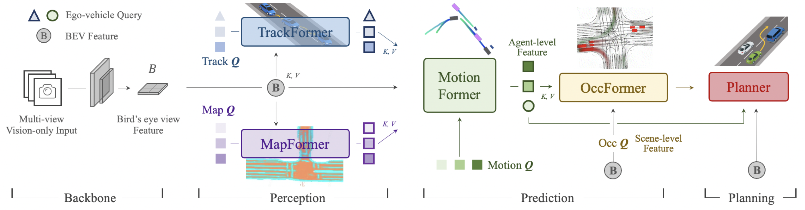
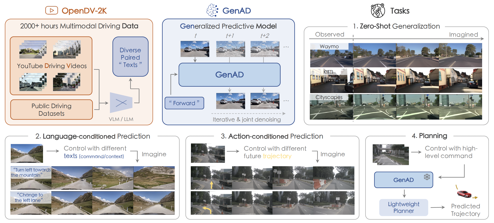
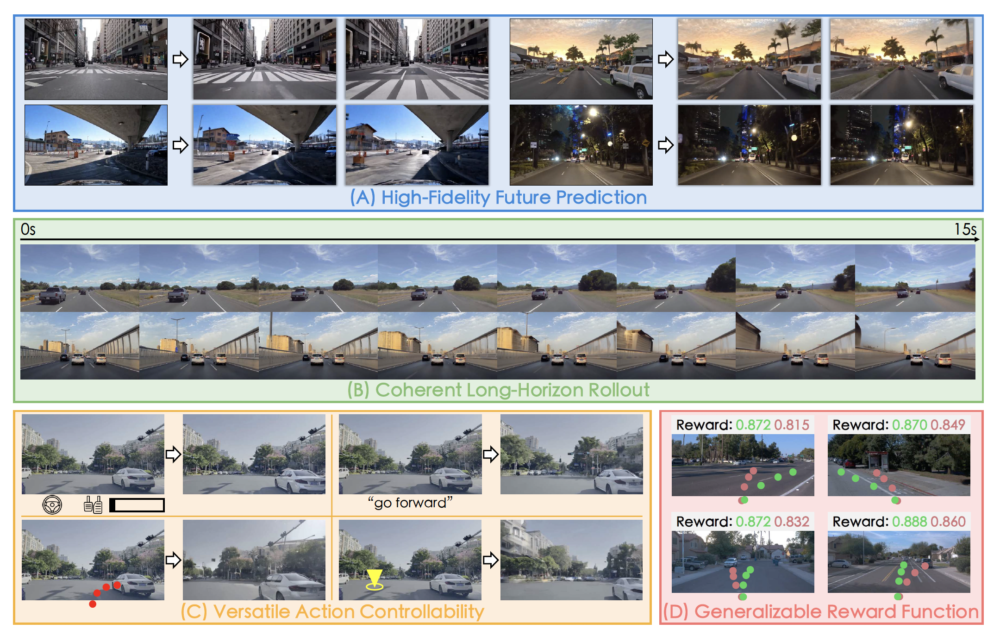

## Good to see you!

### About Me
I am Jiazhi Yang (杨佳智).

I am a first-year Ph.D. student at [MMLab](https://mmlab.ie.cuhk.edu.hk/) of CUHK, advised by [Prof. Xiangyu Yue](https://xyue.io/). Meanwhile I am a research intern at [OpenDriveLab](https://opendrivelab.com/), advised by [Prof. Hongyang Li](https://lihongyang.info/).

🤖 I am deeply interested in developing **autonomous policies** for driverless vehicles and robots.

### Selected Research
Full list: [Google Scholar](https://scholar.google.com/citations?user=Ju7nGX8AAAAJ&hl=zh-CN)

🏆 **UniAD**: Planning-oriented Autonomous Driving

> 

- CVPR 2023 **Best Paper Award**
- End-to-end autonomous driving with planning-oriented task hierarchy.
- [arXiv](https://arxiv.org/abs/2212.10156) | [Code and model](https://github.com/OpenDriveLab/UniAD)
- Supplementary: [Intro. video](https://www.youtube.com/watch?v=cyrxJJ_nnaQ) | [Slides](https://opendrivelab.com/e2ead/UniAD_plenary_talk_slides.pdf) | [Poster](https://github.com/OpenDriveLab/UniAD/blob/main/sources/cvpr23_uniad_poster.png)

⭐ **GenAD**: Generalized Predictive Model for Autonomous Driving
> 
- CVPR 2024 **Highlight**
- Generalized video prediction model facilitated with **the largest driving video dataset (1700+ hours in [OpenDV](https://github.com/OpenDriveLab/DriveAGI))**.
- [arXiv](https://arxiv.org/abs/2403.09630) | [OpenDV Dataset](https://github.com/OpenDriveLab/DriveAGI)
- Supplementary: [Intro. video](https://www.youtube.com/watch?v=a4H6Jj-7IC0) | [Slides](https://opendrivelab.github.io/content/GenAD_slides_with_vista.pdf) | [Poster](https://github.com/OpenDriveLab/DriveAGI/blob/main/assets/cvpr24_genad_poster.png)

🌎 **Vista**: A Generalizable Driving World Model with High Fidelity and Versatile Controllability
> 
- NeurIPS 2024
- **The world's first** generalizable driving world model capable of simulating open scenarios with multi-modal control.
- [arXiv](https://arxiv.org/abs/2405.17398) | [Code and model](https://github.com/OpenDriveLab/Vista)

### Contact Me
- Email: jzyang@link.cuhk.edu.hk
- Twitter: https://x.com/jiazhi_yang2024
- LinkedIn: https://www.linkedin.com/in/jiazhi-yang-a07805208/
- WeChat: thisisshawnyang [💬 breakdown: this is shawn yang]

